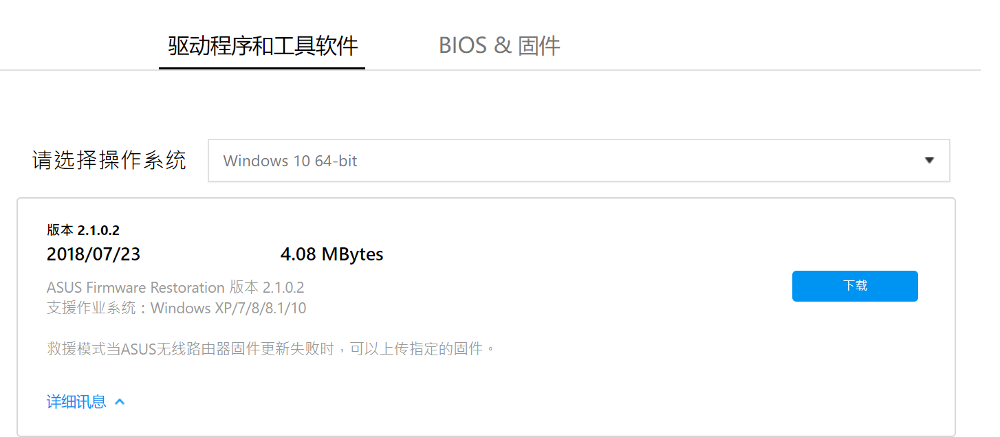

# ASUS RT-ACRH17救援模式强制刷机教程
## 工具
* 固件恢复工具[*ASUS Firmware Restoration*](https://dlsvr04.asus.com.cn/pub/ASUS/wireless/4G-AC53U/Rescue_2102.zip)  
地址:https://www.asus.com.cn/Networking/RT-ACRH17/HelpDesk_Download/    

* [固件（一定要下最老的版本）；3.0.0.4.382.50243](https://dlsvr04.asus.com.cn/pub/ASUS/wireless/4G-AC53U/Discovery_1482.zip)

## 刷机过程
* PC上操作
  1. 修改PC的IP地址192.168.1.10 网关192.168.1.1；
  2. 禁用除本地网络或者以太网以外的其他网络；
  3. 安装工具打开工具加载好固件等待路由器进入救援模式；
* 路由器上操作
  1. 进入救援模式：断开RT-ACRH17电源（**重点：拔插座**），**按住**RT-ACRH17的reset按钮，然后通电（**插插座**）（应该不需要按电源键，忘了，可以先试一下不按电源，如果进入救援模式就说明不按电源键）等待电源灯慢闪；
  2. 当电源指示灯慢闪后，点击工具上的上传按钮等待上传和自动更新完成；
## 遇到的问题
* 未发现无线设备，这是由于设备没有进入救援模式；
解决办法：禁用以太网以外的其他网络，重新进入救援模式；
* 固件上传成功，但是系统自动更新失败；
解决办法：使用固件版本较高，换为更老旧的低版本固件；
